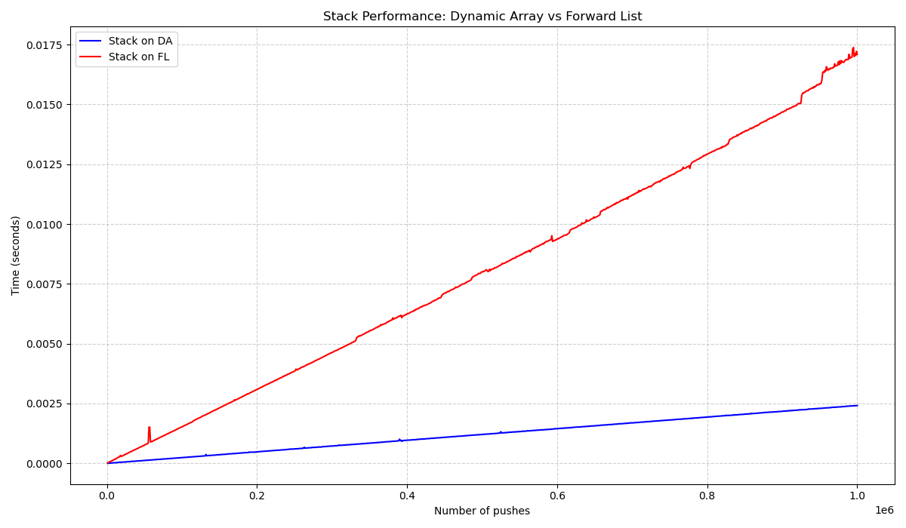

# Сравнение производительности реализаций стека

## Описание

В данной работе сравнивается производительность двух реализаций стека целых чисел:

- **Стек на динамическом массиве**	— хранит элементы в непрерывном блоке памяти, автоматически расширяется при заполнении.

- **Стек на односвязном списке**	— каждый элемент хранится в отдельном узле, память выделяется динамически под каждый `push`.

Измерения проводились на процессоре `AMD Ryzen 7 7745HX`, компилятор `gcc (GCC) 16.1.1 20260430`, флаги оптимизации `-Ofast`.

---

## Тест 1: [РЕЗУЛЬТАТЫ ТЕСТА 1]

| Реализация |     Время, с    |
|------------|-----------------|
| Массив     | `0.0075-0.0078` |
| Список     | `0.070-0.073`   |

Список оказался в **~9.3** раз медленнее массива.

---

## Тест 2: [РЕЗУЛЬТАТЫ ТЕСТА 2]

| Реализация |   Время, с    |
|------------|---------------|
| Массив     | `0.015-0.016` |
| Список     | `0.14`        |

Список оказался в **~9** раз медленнее массива.

---

## Тест 3: [РЕЗУЛЬТАТЫ ТЕСТА 3]

| Реализация |     Время, с    |
|------------|-----------------|
| Массив     | `0.0043-0.0046` |
| Список     | `0.013`         |

Список оказался в **~3** раз(а) медленнее/быстрее массива.

---

## Тест 4: Масштабируемость

Измерялось суммарное время выполнения `n` операций `push` для `n` от `1'000` до `1'000'000` с шагом `1'000`.



Характер роста времени у обеих реализаций линейный, что соответствует амортизированному времени `O(1)` на операцию.

---

## Вывод

**Стек на массиве стабильно быстрее** во всех проведённых тестах. Выигрыш составляет от **3** до почти что **10** раз в зависимости от сценария.

Такой исход можно объснить тем, что:

- В массиве элементы лежат в памяти последовательно, что эффективно использует кеш процессора. Это в особенности хорошо из-за того,
  в стеке мы работаем только с концом массива и не обращаемся к произвольным его местам.

- В массиве выделение памяти происходит только при расширении буфера, что в большинстве реализаций, как и в моей, составляет лишь `O(log(n))`
  медленных системных вызовов на контрасте с `O(n)` в списке.

- В списке переход к следующему элементу происходит через разыменование указателя, что занимает немного больше процессорного времени, чем
  инкремент индекса или самого указателя на элемент.

---

## Сборка и запуск

Обратите внимание, что по умолчанию проект собирается в медленном Debug-режиме. Чтобы собрать/запустить его в Release-режиме нужно передать
`make` переменную RELEASE=1. Также при смене режима понадобиться флаг -B или вызов make clean, чтобы выполнить полную пересборку.

```bash

# Проведение всех необходимых измерений и построение графика
make total

# Проведение всех необходимых измерений
make all_tests

# Построение графика 4-го теста
make plot

# Только сборка проекта, без запуска
make

# Очистить все результаты сборки и работы проекта
make clean
