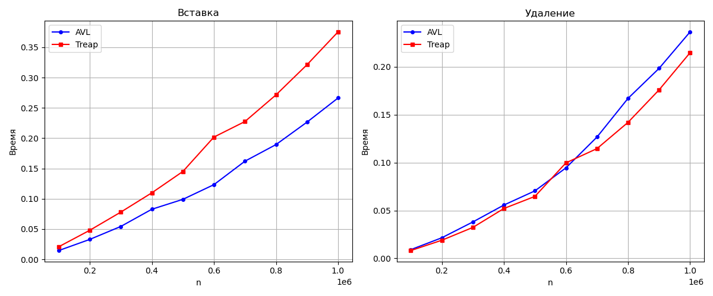

# Сравнение производительности реализаций стека

## Описание

В данной работе сравнивается производительность различных поисковых структур

Измерения проводились на процессоре `AMD Ryzen 7 7745HX`, компилятор `gcc (GCC) 16.1.1 20260430`,  
флаги оптимизации `-Ofast`.

---

## Тест 1:

| | Вставка, с | Удаление, с |
|-|------------|-------------|
| Случайные числа | `0.01` | `0.006` |
| Отсортированные | `0.04` | `0.02` |

Этот тест хорошо показывает изъян **Наивного дерева поиска** - оно катострафически страдает при упорядоченных данных из-за того,
что превращается в бамбук: в случае с отсортированными числами количество вставок и удалений уменьшилось в 10 раз, но затраченное
время при этом выросло!

---

## Тест 2:

| Вставка, с | Удаление, с |
|------------|-------------|
| `0.087` | `0.23` |

Этот тест на контрасте с первым показывает, что **Балансируемыемым деревьям** удается избежать проблем **Наивных** - при увеличении числа операций
в 100 раз время на вставку и удаление увеличилось всего в `~2` и `~10` раз, соответственно.

---


## Масштабируемость

Измерялось суммарное время выполнения `n` операций `insert` и `n / 2` операций `erase` для `n` от `100'000` до `1'000'000` с шагом `100'000`.



Характер роста времени более, чем линейный, но вполне походит на теоретически обещанные `O(n * log(n))`.

---

## Вывод

Очевидный вывод состоит в том, что, несмотря, на возможную простоту реализации, наивные деревья поиска очень не эффективны в особых случаях
(которые, к тому же, не так редки), а потому их следует избегать. Среди рассмотренных мной сбалансированных деревьев поиска не получается
определить однозначного кандидата и они все имеют свои плюсы, например, быстрая вставка у AVL или быстрое удаление вместе с повышенным функционалом у Декартова.

---

## Сборка и запуск

Обратите внимание, что по умолчанию проект собирается в медленном Debug-режиме. Чтобы собрать/запустить его в Release-режиме нужно передать
`make` переменную RELEASE=1. Также при смене режима понадобиться флаг -B или вызов make clean, чтобы выполнить полную пересборку.

```bash

# Проведение всех необходимых измерений и построение графика
make total

# Проведение всех необходимых измерений
make all_tests

# Построение графика
make plot

# Только сборка проекта, без запуска
make

# Очистить все результаты сборки и работы проекта
make clean
